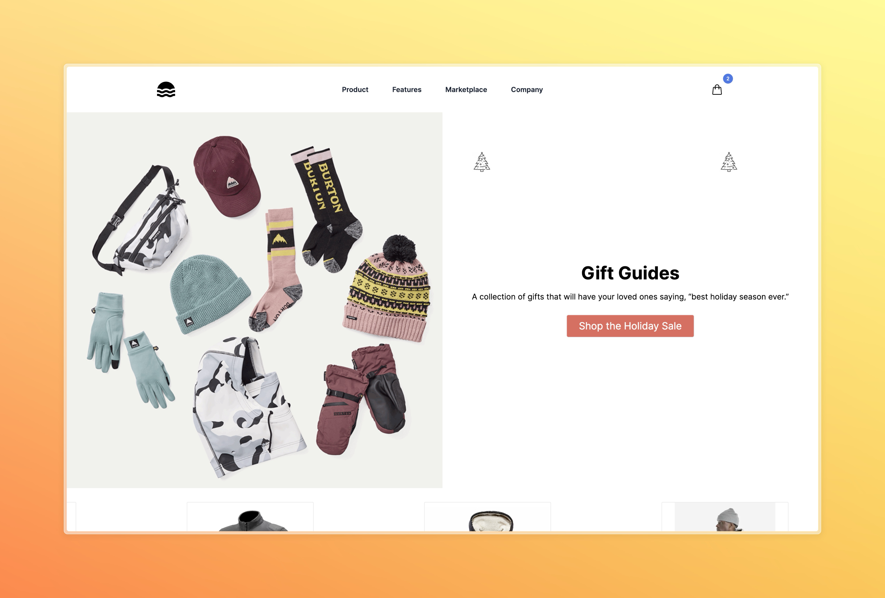

# Commerce 
This Next.js 14 e-commerce starter kit is the fruit of that exploration. It's not just a collection of technologies; it's a carefully crafted solution born out of the desire to break free from 'app land'. By integrating Shopify in a headless manner, I've unlocked a level of customization and feature integration that a typical Shopify setup couldn't dream of. Contentful adds to this freedom, providing a CMS experience that's as flexible as it is powerful. And with plans to integrate Netsuite for ERP, this project is poised to evolve into a robust, all-in-one e-commerce solution.

Algolia is the final piece of this tech puzzle, ensuring that the search experience is as seamless and effective as the rest of the platform. This project is more than just a test of capabilities; it's a step towards redefining what an e-commerce platform can be when you're not afraid to push the boundaries.

## Tech Stack:

- Shopify: Powering the e-commerce engine in a headless setup for that sweet, sweet customizability and performance.
- Contentful: The CMS of choice, easy to manage and primed for syncing up with the upcoming ERP system to keep inventory in check.
- Netsuite: The ERP heavyweight, slated for future integration to bring order to chaos and efficiency to operations.(planned)


## Getting Started

Firstly Create a `.env.local` file similar to `.env.example` and add your ,Shopify, Contentful Credentials.

Then run the development server:

```bash

Run the development server:

```bash
npm run dev
# or
yarn dev
# or
pnpm dev
# or
bun dev
```

Open [http://localhost:3000](http://localhost:3000) with your browser to see the result.

Caching has been disabled for development purposes. To enable caching, set `CACHE_BEHAVIOUR='force-cache'` in your `.env.local` file.
To disable caching, set `CACHE_BEHAVIOUR='no-cache'` in your `.env.local` file.
This project is intended to be deployed on the edge, so caching is enabled by default.

You can start editing the page by modifying `app/page.tsx`. The page auto-updates as you edit the file.

This project uses [`next/font`](https://nextjs.org/docs/basic-features/font-optimization) to automatically optimize and load Inter, a custom Google Font.

## Screenshots




## Learn More

To learn more about Next.js, take a look at the following resources:

- [Next.js Documentation](https://nextjs.org/docs) - learn about Next.js features and API.
- [Learn Next.js](https://nextjs.org/learn) - an interactive Next.js tutorial.

You can check out [the Next.js GitHub repository](https://github.com/vercel/next.js/) - your feedback and contributions are welcome!

## Deploy on Vercel

The easiest way to deploy your Next.js app is to use the [Vercel Platform](https://vercel.com/new?utm_medium=default-template&filter=next.js&utm_source=create-next-app&utm_campaign=create-next-app-readme) from the creators of Next.js.

Check out our [Next.js deployment documentation](https://nextjs.org/docs/deployment) for more details.
